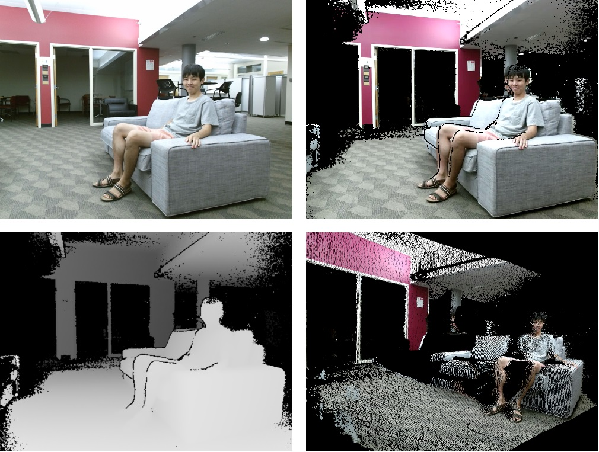

# Kinect to HoloLens
A pipeline that connects a Kinect for Azure and a HoloLens in real-time.

The version for a Kinect v2 and a HoloLens:  
https://github.com/hanseuljun/kinect-to-hololens/tree/291dab26dd0d644ca38284e155c0ab74dac763cc



# Requirement
- A Windows 10 computer, a Kinect v2, and a HoloLens.
- CMake, Unity3D 2018.4, and Visual Studio 2019.

# How to Use
Download the examples from https://github.com/hanseuljun/kinect-to-hololens/releases.  
For installing the HoloLens application, see https://docs.microsoft.com/en-us/hololens/holographic-custom-apps.

# Build Instructions
1. Initiate vcpkg as a submodule (git submodule init, git submodule update).
2. Run bootstrap-vcpkg.bat in vcpkg to build vcpkg.exe.
3. Use vcpkg.exe to install c++ libraries: asio, ffmpeg, libvpx, and opencv.
```powershell
.\vcpkg.exe install asio:x86-windows asio:x64-windows ffmpeg:x86-windows ffmpeg:x64-windows libvpx:x86-windows libvpx:x64-windows opencv:x86-windows opencv:x64-windows
```
4. Install Kinect for Azure Kinect Sensor SDK 1.3.0 (https://docs.microsoft.com/en-us/azure/Kinect-dk/sensor-sdk-download).
- Currently, azure-kinect-sensor-sdk cannot be built as a static library. Also, Installing from above gives you easy acceess to Azure Kinect Viewer, which is very convenient to have.
5. Run run-cmake.ps1 in cpp to build Visual Studio solutions with CMake.
6. Run build-plugin.ps1 that builds a Unity3D plugin with the Visual Studio solution, then copies DLL files including the plugin into the Unity3D project in unity/KinectToHoloLens.
7. Build executable files with the Unity3D project and the Visual Studio solution in cpp/build/x64.

# Examples
## Examples that does not require a HoloLens
### kinect_reader_demo.exe
1. Connect your computer to an Azure Kinect.
2. Run the exe file.

### kinect_sender_demo.exe and kinect_receiver_demo.exe
1. Connect a computer to an Azure Kinect.
2. Run kinect_sender_demo.exe and enter a port number.
3. Run kinect_receiver_demo.exe from another computer and enter the IP address and the port number of the sender.

## Examples for a HoloLens
### kinect_sender_demo.exe and Kinect to HoloLens
1. Connect a computer to an Azure Kinect.
2. Run kinect_sender_demo.exe with the computer and enter a port number.
3. With *the computer*, (install and) run 'Microsoft HoloLens' as an application (https://www.microsoft.com/en-us/p/microsoft-hololens/9nblggh4qwnx).
4. Through the application, connect your computer to a HoloLens as a device. This step requires the IP address of the HoloLens device and also the device has to be turned on to be connected.
5. Run 'Kinect to HoloLens' with the HoloLens device.
6. Enter the IP address and port of the computer running kinect_sender_demo.exe to 'Kinect to HoloLens'. This requires usage of the virtual keyboard in the 'Microsoft HoloLens' as an application. First, you will be able enter the IP address through the virtual keyboard. Then use the tab key to switch mode for entering the port, then enter the port. After that, press enter.
7. Done!

# To Cite
Jun, H., Bailenson, J.N., Fuchs, H., & Wetzstein, G. (in press). An Easy-to-use Pipeline for an RGBD Camera and an AR Headset. *PRESENCE: Teleoperators and Virtual Environments*.
